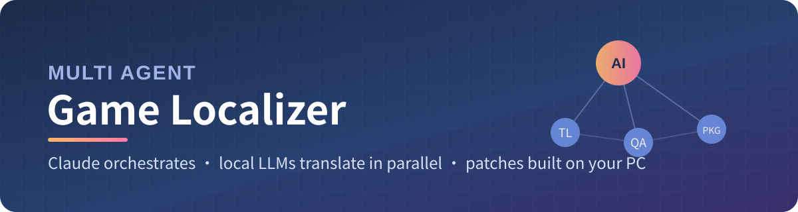
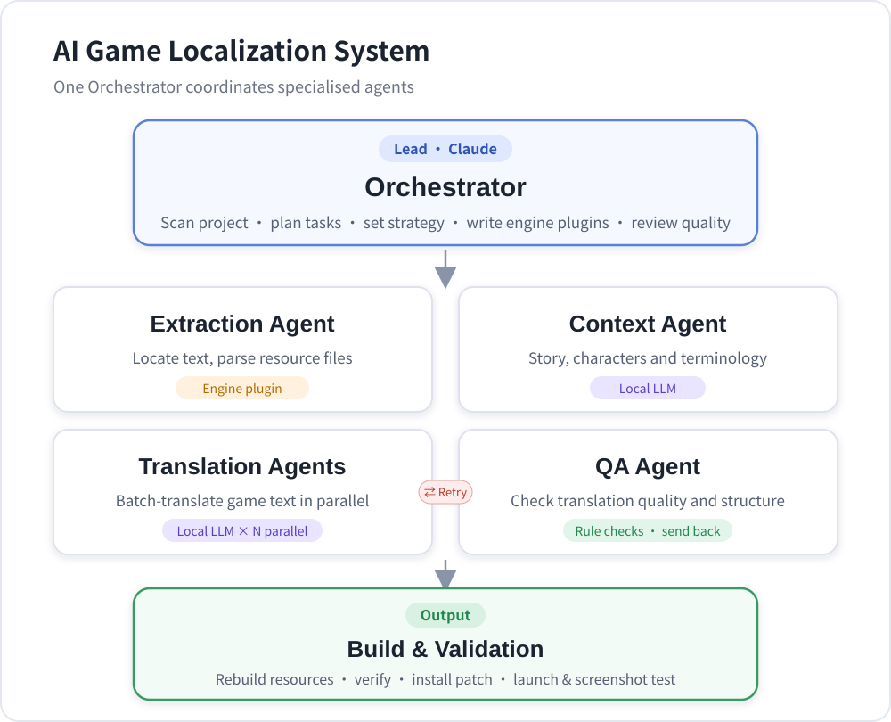
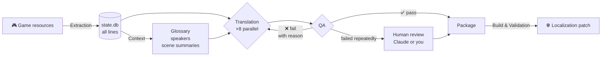
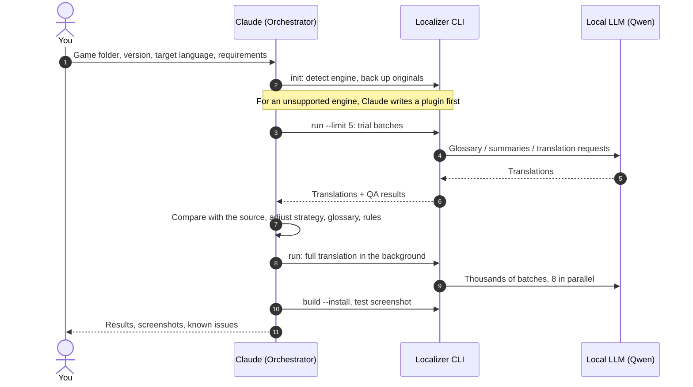

<p align="center">
  
</p>

<p align="center">
  <b>English</b> · <a href="README.zh-CN.md">简体中文</a>
</p>

<p align="center">
  
  
  
  
  
  
</p>

<p align="center">
  <b>Claude does the thinking, local models do the heavy lifting.</b><br>
  Claude understands the game, sets the strategy, writes engine plugins and reviews quality;<br>
  a local LLM translates tens of thousands of lines in parallel, into any language it knows.<br>
  The patch is built on your own PC from your own game files, so there is no need to download a patch from an unknown source.
</p>

<p align="center">
  <a href="#-pain-points-it-solves">Why</a> ·
  <a href="#-architecture">Architecture</a> ·
  <a href="#-languages">Languages</a> ·
  <a href="#-requirements">Requirements</a> ·
  <a href="#-quick-start">Quick start</a> ·
  <a href="#-how-to-prompt-claude">Prompting</a> ·
  <a href="#-adding-a-new-engine">New engines</a>
</p>

---

## 📊 Real-world result

AliceSoft's *Evenicle* (Steam English release, v1.04) translated into Simplified Chinese on an RTX 4070 12GB:

<table>
  <tr>
    <td align="center"><h3>65,474</h3>story lines</td>
    <td align="center"><h3>4,281</h3>UI strings</td>
    <td align="center"><h3>≈ 9 lines/s</h3>8 parallel slots</td>
    <td align="center"><h3>≈ 2 hours</h3>whole script</td>
    <td align="center"><h3>≈ 95%</h3>pass QA first time</td>
  </tr>
</table>

The translated text renders in-game, long lines wrap correctly, and the name box, inner-monologue brackets and multi-line layout match the original release.

---

## 🎯 Pain points it solves

<table>
  <tr>
    <td width="50%" valign="top">
      <h4>🗣️ Machine translation is bad</h4>
      Pasting lines one by one into a translator gives no context, inconsistent names, and plenty of omissions.<br><br>
      <b>Here:</b> lines are translated scene by scene. Every batch carries the translation strategy, a scene summary, the speaker, the glossary and the previous lines. Lines that fail QA are sent back automatically.
    </td>
    <td width="50%" valign="top">
      <h4>🛡️ Is that fan patch safe?</h4>
      Patches and executables from forums and file hosts cannot be verified.<br><br>
      <b>Here:</b> the code is open source, and the patch is generated on your machine from your own game files. Originals are backed up automatically, and one command restores them.
    </td>
  </tr>
  <tr>
    <td valign="top">
      <h4>⏳ Waiting for a translation group</h4>
      Niche titles and new versions get no translation, and patches made for another release do not fit yours.<br><br>
      <b>Here:</b> do it yourself in a few hours. After a game update, extract again and translate only what changed.
    </td>
    <td valign="top">
      <h4>🌍 Only one language pair</h4>
      Most tools and fan patches cover only one direction, such as Japanese to English.<br><br>
      <b>Here:</b> source and target are per-project settings. Any language the model knows works, and common languages come with tuned rules.
    </td>
  </tr>
  <tr>
    <td valign="top">
      <h4>🧩 Every engine is different</h4>
      Every engine packs its text differently.<br><br>
      <b>Here:</b> engines are plugins. For a new engine, Claude analyses the file format and writes a plugin. Context, translation, QA and packaging are reused unchanged.
    </td>
    <td valign="top">
      <h4>💸 Cloud LLMs for every line cost too much</h4>
      Sending tens of thousands of lines to a cloud API eats money and quota.<br><br>
      <b>Here:</b> the bulk translation runs on a free, offline local model. Claude only does the work that needs judgement.
    </td>
  </tr>
</table>

> [!NOTE]
> **About "works with every game":** the architecture is engine-agnostic, but each engine needs a plugin. The built-in, tested plugin is **AliceSoft System 4** (`.ain` + `.fnl`, e.g. Evenicle and the Rance series).
> For Ren'Py, RPG Maker, Kirikiri, Unity and others, ask Claude to write a plugin first (see [Adding a new engine](#-adding-a-new-engine)). After that it runs the same way.

---

## 🏗️ Architecture

<p align="center">
  
</p>

### Who does what

| Role | Played by | Responsibilities |
|:--|:--|:--|
| 🧠 **Orchestrator** | **Claude** (Claude Code) | Identifies the engine and writes plugins; reviews the strategy and glossary; spot-checks trial batches; fixes systematic problems in rules or prompts; handles lines flagged for review; installs the patch and verifies it with in-game screenshots |
| ⚙️ Pipeline scheduler | `orchestrator.py` | Runs the agents stage by stage. State lives in SQLite, so a run can stop and resume at any time |
| 📦 Extraction Agent | Engine plugin | Unpacks, extracts text, detects speakers, skips what needs no translation, imports existing human translations |
| 📚 Context Agent | Local LLM | Mines proper nouns into a glossary, maps speakers to target-language names, writes a summary for every scene |
| ✍️ Translation Agents | Local LLM × N | Translate scene by scene with strategy, summary, glossary and previous lines in the prompt |
| 🔍 QA Agent | Rules | Checks for omissions, untranslated words, refusals, quote and continuation structure, `%s` `%d` `$` and line breaks, length outliers and glossary consistency |
| 🚀 Build & Validation | Engine plugin | Writes text back, generates font glyphs, re-reads every line to verify it, checks for missing glyphs, installs and uninstalls, and takes smoke-test screenshots |

### The journey of one line



### How Claude and the local model work together



---

## 🌍 Languages

Source and target language are set per project. You can use a code or a name:

```bat
venv\Scripts\python -m hanhua init MyGame "D:\Games\MyGame" "My Game" --src ja --tgt en
venv\Scripts\python -m hanhua init MyGame "D:\Games\MyGame" "My Game" --src en --tgt "Brazilian Portuguese"
```

| | Languages |
|:--|:--|
| **Tuned profiles** | `zh-CN` Simplified Chinese · `zh-TW` Traditional Chinese · `ja` Japanese · `ko` Korean · `en` English · `es` Spanish · `fr` French · `de` German · `pt` Portuguese · `it` Italian · `ru` Russian · `uk` Ukrainian · `pl` Polish · `vi` Vietnamese · `id` Indonesian · `tr` Turkish |
| **Anything else** | Any language name the model understands. It uses a generic profile with the language's own punctuation, and script-specific QA checks are skipped |

A profile defines punctuation rules, a plausible length ratio for QA, and whether leftover source-language words should be flagged. Run `python -m hanhua langs` to list them, or add your own in `hanhua/langs.py`.

> [!IMPORTANT]
> What the game can display depends on the engine. The System 4 plugin draws any character that is laid out one glyph at a time: CJK, Hangul, Latin with accents, Cyrillic and Greek. Scripts that need shaping, such as Arabic, Hebrew or Thai, are not supported by that old engine. Translation quality also depends on how well the chosen model knows the language, so try a few batches first.

---

## 💻 Requirements

| | Minimum | Recommended |
|:--|:--|:--|
| **OS** | Windows 10 64-bit | Windows 11 64-bit |
| **GPU** | NVIDIA 8GB VRAM (set parallel slots to 2–4, or use a Q4_K_M quant) | **NVIDIA 12GB VRAM** (default: 8 parallel slots use about 9.4GB) |
| **RAM** | 16GB | 32GB |
| **Disk** | 15GB free | SSD |
| **Python** | 3.10 | 3.12 |
| **Orchestrator** | [Claude Code](https://claude.com/claude-code) with a Claude subscription or API key | Same |
| **Network** | Only for the first `setup` download | Translation runs fully offline |

<details>
<summary><b>What <code>setup</code> downloads</b></summary>

| Component | Source | Location | Size |
|:--|:--|:--|:--|
| Inference engine | [llama.cpp](https://github.com/ggml-org/llama.cpp) Windows CUDA 12.4 build | `runtime/llama/` | about 0.7GB |
| Model | [Qwen3.5-9B GGUF Q6_K](https://huggingface.co/unsloth/Qwen3.5-9B-GGUF) (Apache-2.0), with an hf-mirror fallback | `models/` | about 7.1GB |
| System 4 tools | [alice-tools](https://github.com/nunuhara/alice-tools) (GPL) | `tools/alice-tools/` | about 20MB |

Without an NVIDIA GPU it still runs: use the llama.cpp CPU build and set `gpu_layers` to 0 in `config.json`. It will be many times slower. To use another model, put the GGUF file in `models/` and change `llm.model`.

</details>

---

## 🚀 Quick start

**1. Install**

```bat
git clone https://github.com/binbingwu/Multi-Agent-Game-Localizer.git
cd Multi-Agent-Game-Localizer
python -m venv venv
venv\Scripts\pip install pillow
venv\Scripts\python -m hanhua setup
```

**2. Hand it to Claude**

Open Claude Code in this folder and send it the prompt from [the next section](#-how-to-prompt-claude).

**3. Or run it yourself**

For engines that are already supported you can skip Claude and use the commands below, or double-click `汉化器.bat` for a menu. The menu and log messages are in Chinese.

<details>
<summary><b>All commands</b></summary>

```bat
venv\Scripts\python -m hanhua init <project> "<game dir>" "<title>" --src en --tgt ja   :: create project, back up originals
venv\Scripts\python -m hanhua run <project> --limit 5          :: trial: 5 batches only
venv\Scripts\python -m hanhua run <project>                    :: full pipeline, resumable
venv\Scripts\python -m hanhua status <project>                 :: progress
venv\Scripts\python -m hanhua build <project> --install        :: package and install (close the game first)
venv\Scripts\python -m hanhua test <project>                   :: launch the game, screenshot, close
venv\Scripts\python -m hanhua export <project>                 :: export lines needing review to review.tsv
venv\Scripts\python -m hanhua import <project> review.tsv      :: import your fixes (locked)
venv\Scripts\python -m hanhua uninstall <project>              :: restore the original files
venv\Scripts\python -m hanhua langs                            :: list language profiles
```

`run` accepts `--stages extract,context,translate,build` to run only some stages.

</details>

---

## 💬 How to prompt Claude

When Claude opens this folder it reads [`CLAUDE.md`](CLAUDE.md), which describes its role as orchestrator, the workflow and the rules. You only need to say **where the game is, what you want, and what must not be touched**.

### Starter prompt

```text
You are the orchestrator of this localizer; follow CLAUDE.md.
Game: <name>, folder D:\Games\XXX, Steam English release v1.2 (originally Japanese, I only own the English version).
Translate into: German. Text only (no images or voice). Adult content translated faithfully.
Detect the engine, translate a small trial batch and show me the quality before running everything.
My PC has an RTX 4070 12GB. The game may be open: make sure it is closed before installing, and don't touch my saves.
```

### Six tips

| | Tip | Why |
|:--:|:--|:--|
| 1️⃣ | **Give the folder and version** | Steam and other releases often differ; the version tells Claude whether existing resources apply |
| 2️⃣ | **Name the source and target language** | Claude sets `--src` / `--tgt`; say which variant you want, e.g. Brazilian vs. European Portuguese |
| 3️⃣ | **State the scope and style** | Text only or images too, UI or not, and preferences like "casual dialogue" or "use these established names: A → X". They go into `strategy.md` and `glossary.json` and apply to every sub-agent |
| 4️⃣ | **Ask for a trial first** | `run --limit` a few batches and review them side by side before a multi-hour run |
| 5️⃣ | **Say what must not be touched** | "Don't overwrite files while the game is running", "back up my saves first" |
| 6️⃣ | **Unsupported engine? Say so** | "Please write a plugin for this engine." Claude implements the interface and verifies it in-game |

<details>
<summary><b>Useful follow-ups</b></summary>

```text
Show me 30 freshly translated lines next to the source and point out the weak ones.
Change these names: X → A, Y → B, and send the affected lines back for retranslation.
What is the most common QA failure? Is it the model or are the rules too strict?
Build, install, launch the game and show me a screenshot to check wrapping and the font.
```

</details>

---

## 📁 Project workspace

Each game gets `projects/<project>/`:

| File | Purpose | Editable |
|:--|:--|:--:|
| `project.json` | Game folder, engine, `source_lang` / `target_lang` | ✅ |
| `strategy.md` | Translation strategy, sent with every request | ✅ |
| `glossary.json` | Glossary (source → target) | ✅ |
| `glossary_ignore.json` | Words that must not become glossary terms | ✅ |
| `speakers.json` | Speaker → target-language name | ✅ |
| `import/*.json` | Existing human translations `{key: text}`, locked after import | ✅ |
| `state.db` | All lines, translations and status | via export / import |
| `original/` | Backup of the original game files | ❌ |
| `build/` · `logs/` | Generated patch, logs, screenshots | — |

**Line status:** `new` → `translated` → `qa_ok`. Failures become `qa_fail` and go back with the reason. After too many retries they become `review`; they are still packaged, but you should export and fix them. Locked lines are never overwritten by the model.

---

## 🔌 Adding a new engine

Implement the interface in [`base.py`](hanhua/engines/base.py) in `hanhua/engines/<engine>/plugin.py` and register it in `hanhua/engines/__init__.py`:

| Method | Purpose |
|:--|:--|
| `detect(game_dir)` | Is this folder a game of this engine? |
| `backup` · `scan` | Back up originals and report file info |
| `extract()` | Return lines: `key` `kind` `seq` `scene` `speaker` `source` `skip` |
| `build(translations)` | Write translations back, handle encoding and fonts, output to `build/` |
| `validate(translations)` | Read back and verify, check for missing glyphs |
| `install` · `uninstall` · `game_running` | Install, restore, detect a running game |

Context, translation, QA and packaging need no changes. The easiest way is to tell Claude:

```text
This game uses the XX engine. Write a plugin for it modelled on the System 4 plugin,
and verify in-game with a few translated lines that the text displays.
```

---

## 🗂️ Layout

```text
汉化器.bat              menu launcher (Chinese UI)
config.json            model, parallel slots, batch size, default languages, QA thresholds
CLAUDE.md              instructions for Claude as orchestrator
docs/                  README images
hanhua/
├─ orchestrator.py     pipeline scheduling, translation strategy
├─ langs.py            language profiles
├─ llm.py              local model server (llama.cpp, OpenAI-compatible API)
├─ agents/             extraction · context · translation · qa · build
├─ engines/            engine plugins (system4 implemented)
└─ setup.py            downloads the inference engine, model and tools
tools/gui.ps1          screenshots and simulated clicks for smoke tests
```

---

## 📜 License

The code is released under [GPL-3.0](LICENSE). Parsing of the System 4 font format follows [libsys4 / xsystem4](https://github.com/nunuhara/xsystem4) (GPL-2.0+). The unpacking tool [alice-tools](https://github.com/nunuhara/alice-tools) is GPL.

> [!IMPORTANT]
> Only use this tool on games you legally own. Generated patches are for personal use. Do not distribute files that contain the game's original text or assets.
