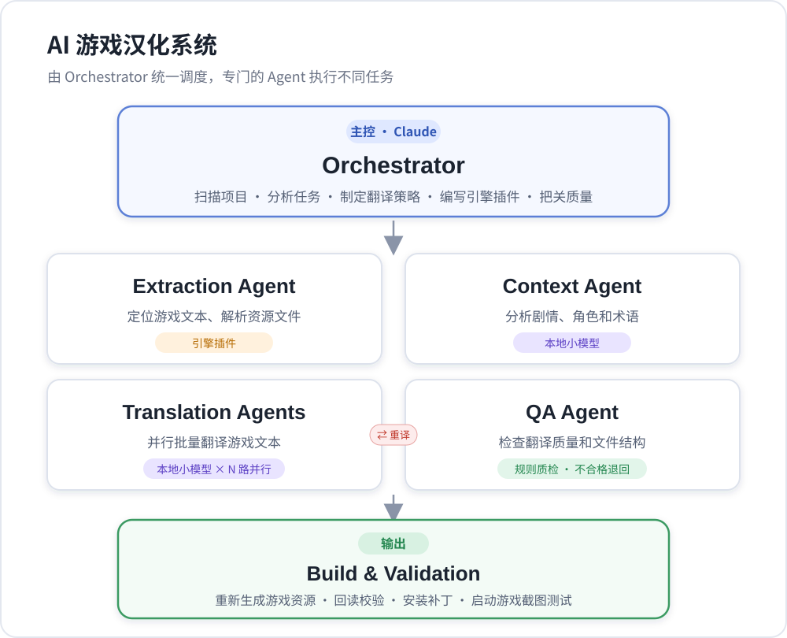
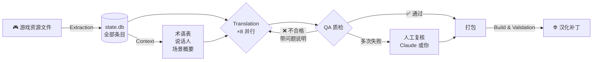
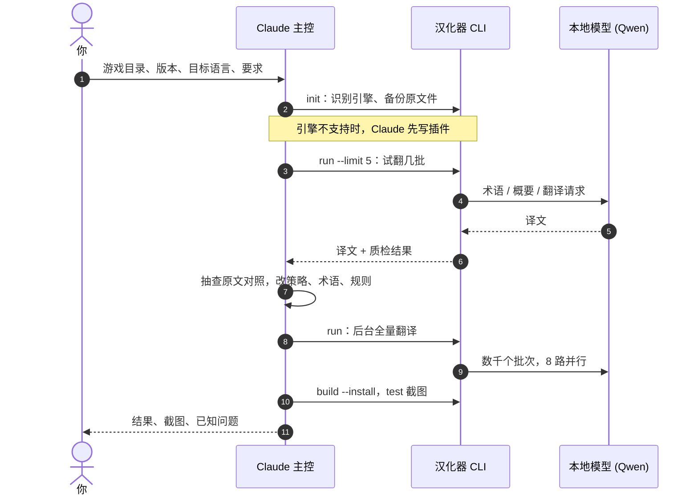

<p align="center">
  
</p>

<p align="center">
  <a href="README.md">English</a> · <b>简体中文</b>
</p>

<p align="center">
  
  
  
  
  
  
</p>

<p align="center">
  <b>Claude 负责动脑，本地小模型负责干活。</b><br>
  Claude 看懂游戏、制定策略、编写引擎插件、把关质量；本地模型把几万条台词并行翻完，翻成它会的任何语言。<br>
  补丁在你自己的电脑上、用你自己的正版游戏文件生成，不用再下载来路不明的汉化包。
</p>

<p align="center">
  <a href="#-解决了哪些痛点">痛点</a> ·
  <a href="#-架构">架构</a> ·
  <a href="#-支持的语言">语言</a> ·
  <a href="#-运行配置">配置</a> ·
  <a href="#-快速开始">快速开始</a> ·
  <a href="#-怎么给-claude-写提示词">提示词</a> ·
  <a href="#-接入新引擎">接入新引擎</a>
</p>

---

## 📊 实测成绩

AliceSoft《Evenicle》Steam 英文版 v1.04 翻译成简体中文，硬件是 RTX 4070 12GB：

<table>
  <tr>
    <td align="center"><h3>65,474</h3>条剧情台词</td>
    <td align="center"><h3>4,281</h3>条界面文字</td>
    <td align="center"><h3>≈ 9 条/秒</h3>8 路并行翻译</td>
    <td align="center"><h3>≈ 2 小时</h3>全文翻完</td>
    <td align="center"><h3>≈ 95%</h3>质检一次通过</td>
  </tr>
</table>

译文在游戏内显示正常，长句自动换行正常，人名框、心理独白括号、多行台词排版都与原版一致。

---

## 🎯 解决了哪些痛点

<table>
  <tr>
    <td width="50%" valign="top">
      <h4>🗣️ 机翻质量差</h4>
      逐句丢给翻译软件，没有上下文，人名前后不一，漏译错译多。<br><br>
      <b>这里：</b>按场景分批翻译。每批都带上翻译策略、场景剧情概要、说话人、术语表和前几句译文。质检不合格的自动退回重译。
    </td>
    <td width="50%" valign="top">
      <h4>🛡️ 汉化包有没有病毒</h4>
      从论坛、网盘下载别人打包的 exe 或补丁，没法验证里面有什么。<br><br>
      <b>这里：</b>代码全部开源。补丁由你本机用你自己的游戏文件现场生成。原文件自动备份，一条命令就能恢复原版。
    </td>
  </tr>
  <tr>
    <td valign="top">
      <h4>⏳ 只能等汉化组</h4>
      冷门游戏、新版本没人做；给其他版本做的补丁和你的版本对不上。<br><br>
      <b>这里：</b>自己动手，几小时出结果。游戏更新后重新提取，只翻新增部分。
    </td>
    <td valign="top">
      <h4>🌍 只能翻一种语言</h4>
      大多数工具和补丁只做一个方向，比如日译中。<br><br>
      <b>这里：</b>源语言和目标语言是每个项目的设置。模型会的语言都能翻，常用语言还有调好的规则。
    </td>
  </tr>
  <tr>
    <td valign="top">
      <h4>🧩 换一个游戏就不会弄</h4>
      每种引擎的封包格式都不一样。<br><br>
      <b>这里：</b>引擎插件架构。遇到新引擎由 Claude 分析文件格式、编写插件，上下文、翻译、质检、打包流程全部复用。
    </td>
    <td valign="top">
      <h4>💸 全用大模型太贵</h4>
      几万条台词全走云端 API，费用和额度都扛不住。<br><br>
      <b>这里：</b>繁重的逐句翻译交给本地模型，免费又离线。Claude 只做需要判断力的主控工作。
    </td>
  </tr>
</table>

> [!NOTE]
> **关于“通用”：** 架构对所有游戏通用，但每种引擎需要一个插件。目前内置并实测过的是 **AliceSoft System 4**（`.ain` + `.fnl`，例如 Evenicle、Rance 系列）。
> Ren'Py、RPG Maker、Kirikiri、Unity 等引擎，需要让 Claude 按[接入新引擎](#-接入新引擎)的方式先写插件，写好后同样一键运行。

---

## 🏗️ 架构

<p align="center">
  
</p>

### 谁负责什么

| 角色 | 由谁担任 | 职责 |
|:--|:--|:--|
| 🧠 **Orchestrator 主控** | **Claude**（Claude Code） | 识别引擎、编写插件；审改翻译策略和术语表；试翻抽查；发现系统性问题就改规则或提示词后续跑；处理人工复核条目；安装补丁并启动游戏截图验证 |
| ⚙️ 流程调度 | `orchestrator.py` | 按阶段调度各 Agent，状态存在 SQLite，随时中断随时续跑 |
| 📦 Extraction Agent | 引擎插件 | 解包、提取文本、识别说话人、跳过不需翻译的内容、导入已有人工译文 |
| 📚 Context Agent | 本地小模型 | 挖掘专有名词建术语表；把说话人统一成目标语言的名字；为每个场景写剧情概要 |
| ✍️ Translation Agents | 本地小模型 × N 路 | 按场景分批翻译，提示词里带策略、概要、术语和前文 |
| 🔍 QA Agent | 规则 | 查漏译、残留原文、拒答废话、引号和续行格式、`%s` `%d` `$` 换行、长度异常、术语一致性 |
| 🚀 Build & Validation | 引擎插件 | 写回资源、生成字库、逐条回读校验、检查缺字、安装卸载、冒烟测试截图 |

### 一条台词的旅程



### Claude 和本地模型怎么配合



---

## 🌍 支持的语言

源语言和目标语言按项目设置，写语言代码或名称都可以：

```bat
venv\Scripts\python -m hanhua init MyGame "D:\Games\MyGame" "我的游戏" --src ja --tgt zh-CN
venv\Scripts\python -m hanhua init MyGame "D:\Games\MyGame" "My Game" --src en --tgt "Brazilian Portuguese"
```

| | 语言 |
|:--|:--|
| **内置调优配置** | `zh-CN` 简体中文 · `zh-TW` 繁體中文 · `ja` 日本語 · `ko` 한국어 · `en` English · `es` 西班牙语 · `fr` 法语 · `de` 德语 · `pt` 葡萄牙语 · `it` 意大利语 · `ru` 俄语 · `uk` 乌克兰语 · `pl` 波兰语 · `vi` 越南语 · `id` 印尼语 · `tr` 土耳其语 |
| **其他任何语言** | 模型能理解的语言名都可以。使用通用配置：按该语言自己的标点习惯，跳过和文字类型相关的质检 |

语言配置决定标点规则、质检用的合理长度比例，以及要不要检查残留的原文单词。运行 `python -m hanhua langs` 可以查看，也可以在 `hanhua/langs.py` 里添加自己的配置。

> [!IMPORTANT]
> 游戏能显示哪些文字取决于引擎。System 4 插件能画出所有逐字排版的文字：中日韩、带重音的拉丁字母、西里尔字母、希腊字母。阿拉伯语、希伯来语、泰语这类需要连写或复杂排版的文字，这个老引擎显示不了。翻译质量也取决于模型对该语言的掌握程度，建议先试翻几批。

---

## 💻 运行配置

| | 最低 | 推荐 |
|:--|:--|:--|
| **系统** | Windows 10 64 位 | Windows 11 64 位 |
| **显卡** | NVIDIA 8GB 显存（并行改为 2~4，或换 Q4_K_M 量化） | **NVIDIA 12GB 显存**（默认 8 路并行约占 9.4GB） |
| **内存** | 16GB | 32GB |
| **硬盘** | 15GB 可用空间 | SSD |
| **Python** | 3.10 | 3.12 |
| **主控** | [Claude Code](https://claude.com/claude-code)，需要 Claude 订阅或 API | 同左 |
| **网络** | 仅首次 `setup` 下载时需要 | 翻译全程离线 |

<details>
<summary><b>setup 会下载哪些东西</b></summary>

| 组件 | 来源 | 位置 | 大小 |
|:--|:--|:--|:--|
| 推理引擎 | [llama.cpp](https://github.com/ggml-org/llama.cpp) Windows CUDA 12.4 版 | `runtime/llama/` | 约 0.7GB |
| 翻译模型 | [Qwen3.5-9B GGUF Q6_K](https://huggingface.co/unsloth/Qwen3.5-9B-GGUF)（Apache-2.0），失败时自动改用 hf-mirror 镜像 | `models/` | 约 7.1GB |
| System 4 工具 | [alice-tools](https://github.com/nunuhara/alice-tools)（GPL） | `tools/alice-tools/` | 约 20MB |

没有 NVIDIA 显卡也能运行：换成 llama.cpp 的 CPU 版，并把 `config.json` 里的 `gpu_layers` 设为 0，但速度会慢很多倍。想换模型，把 GGUF 文件放进 `models/`，再修改 `llm.model`。

</details>

---

## 🚀 快速开始

**1. 安装**

```bat
git clone https://github.com/binbingwu/Multi-Agent-Game-Localizer.git
cd Multi-Agent-Game-Localizer
python -m venv venv
venv\Scripts\pip install pillow
venv\Scripts\python -m hanhua setup
```

**2. 交给 Claude**

在这个目录里打开 Claude Code，把[下一节](#-怎么给-claude-写提示词)的提示词发给它。

**3. 或者自己动手**

对于已经支持的引擎，也可以不用 Claude，直接用下面的命令，或双击 `汉化器.bat` 按菜单操作。

<details>
<summary><b>全部命令</b></summary>

```bat
venv\Scripts\python -m hanhua init <项目名> "<游戏目录>" "<标题>" --src en --tgt zh-CN   :: 建项目、备份原文件
venv\Scripts\python -m hanhua run <项目名> --limit 5          :: 试翻 5 批，先看质量
venv\Scripts\python -m hanhua run <项目名>                    :: 全流程，可中断续跑
venv\Scripts\python -m hanhua status <项目名>                 :: 进度
venv\Scripts\python -m hanhua build <项目名> --install        :: 打包并安装（先关游戏）
venv\Scripts\python -m hanhua test <项目名>                   :: 启动游戏截图后关闭
venv\Scripts\python -m hanhua export <项目名>                 :: 导出需复核条目 review.tsv
venv\Scripts\python -m hanhua import <项目名> review.tsv      :: 导入人工修改（锁定）
venv\Scripts\python -m hanhua uninstall <项目名>              :: 恢复原版
venv\Scripts\python -m hanhua langs                           :: 列出语言配置
```

`run` 可以用 `--stages extract,context,translate,build` 只跑部分阶段。

</details>

---

## 💬 怎么给 Claude 写提示词

Claude 打开这个目录时会先读 [`CLAUDE.md`](CLAUDE.md)，里面写明了它作为主控的职责、流程和禁止事项。你只需要说清楚**游戏在哪、要什么、有什么限制**。

### 开场模板

```text
你是这个汉化器的主控（Orchestrator），请按 CLAUDE.md 的流程工作。
游戏：<游戏名>，目录 D:\Games\XXX，Steam 英文版 v1.2（原版是日文，但我只有英文版）。
翻译成：简体中文。只汉化文字（不改图片和语音），成人内容照实翻译。
先识别引擎并试翻一小批给我看质量，没问题再全量跑。
我的电脑是 RTX 4070 12GB。游戏可能开着，安装补丁前先确认游戏已关闭，不要动我的存档。
```

### 六个要点

| | 要点 | 为什么 |
|:--:|:--|:--|
| 1️⃣ | **说清楚游戏目录和版本** | Steam 版和其他版本文件经常不同，版本号决定现成资料能不能用 |
| 2️⃣ | **说清楚源语言和目标语言** | Claude 会据此设置 `--src` / `--tgt`；如果有变体要说明，比如简体还是繁体 |
| 3️⃣ | **说清楚范围和风格** | 只翻文字还是连图片一起改、界面翻不翻，以及“对白口语化”“人名沿用某汉化组的译名：A=甲”这类偏好。这些会写进 `strategy.md` 和 `glossary.json`，对所有子 Agent 生效 |
| 4️⃣ | **要求先试翻再全量** | 用 `run --limit` 试几批、看原文对照，确认后再跑，避免跑几个小时才发现方向错了 |
| 5️⃣ | **说明哪些东西不能动** | 例如“游戏开着别覆盖文件”“先备份存档” |
| 6️⃣ | **引擎不支持就直说** | “请为这个引擎写插件”，Claude 会按接口写好并在游戏里验证 |

<details>
<summary><b>过程中常用的追问</b></summary>

```text
抽 30 条刚翻的对话给我看原文对照，挑出翻得不好的并说明原因。
把这些译名改掉：X → 甲，Y → 乙，已经翻过的相关句子退回重译。
QA 退回最多的是哪类问题？是模型的问题还是规则太严？
打包安装后启动游戏截图给我看，检查换行和字体。
```

</details>

---

## 📁 项目工作区

每个游戏一个工作区 `projects/<项目名>/`：

| 文件 | 说明 | 可手改 |
|:--|:--|:--:|
| `project.json` | 游戏目录、引擎、`source_lang` / `target_lang` | ✅ |
| `strategy.md` | 翻译策略，每个翻译请求都会带上 | ✅ |
| `glossary.json` | 术语表（原文 → 译文） | ✅ |
| `glossary_ignore.json` | 不要当成术语的词 | ✅ |
| `speakers.json` | 说话人 → 目标语言名字 | ✅ |
| `import/*.json` | 预置人工译文 `{条目key: 译文}`，导入后锁定 | ✅ |
| `state.db` | 全部条目、译文、状态 | 用 export / import |
| `original/` | 原始游戏文件备份 | ❌ |
| `build/` · `logs/` | 生成的补丁、日志、截图 | — |

**条目状态：** `new` → `translated` → `qa_ok`。不合格为 `qa_fail`，带着问题说明退回重译。超过重试次数为 `review`，仍会打包，建议导出后人工修改。锁定的条目不会被模型覆盖。

---

## 🔌 接入新引擎

在 `hanhua/engines/<引擎名>/plugin.py` 实现 [`base.py`](hanhua/engines/base.py) 的接口，并在 `hanhua/engines/__init__.py` 注册：

| 方法 | 作用 |
|:--|:--|
| `detect(game_dir)` | 判断目录是不是这个引擎的游戏 |
| `backup` · `scan` | 备份原文件、汇报文件信息 |
| `extract()` | 返回条目：`key` `kind` `seq` `scene` `speaker` `source` `skip` |
| `build(translations)` | 写回译文，处理编码和字库，输出到 `build/` |
| `validate(translations)` | 回读校验、字库缺字检查 |
| `install` · `uninstall` · `game_running` | 安装、恢复、检测游戏是否在运行 |

上下文、翻译、质检、打包流程都不需要改。最省事的做法是在 Claude Code 里说：

```text
这个游戏是 XX 引擎，请参考 System 4 插件为它写一个插件，
并用一小段台词在游戏里验证译文能显示。
```

---

## 🗂️ 目录结构

```text
汉化器.bat              一键菜单
config.json            模型、并行数、批大小、默认语言、质检阈值
CLAUDE.md              给 Claude（主控）的工作说明
docs/                  README 用图
hanhua/
├─ orchestrator.py     流程调度、翻译策略
├─ langs.py            语言配置
├─ llm.py              本地模型服务（llama.cpp，OpenAI 兼容接口）
├─ agents/             extraction · context · translation · qa · build
├─ engines/            引擎插件（system4 已实现）
└─ setup.py            下载推理引擎、模型、工具
tools/gui.ps1          截图与模拟点击（冒烟测试用）
```

---

## 📜 许可

代码以 [GPL-3.0](LICENSE) 发布。System 4 字库格式的解析参考了 [libsys4 / xsystem4](https://github.com/nunuhara/xsystem4)（GPL-2.0+），解包工具 [alice-tools](https://github.com/nunuhara/alice-tools) 为 GPL。

> [!IMPORTANT]
> 请只对你合法拥有的游戏使用本工具。生成的补丁仅供个人使用，不要分发含有游戏原文或游戏资源的文件。
